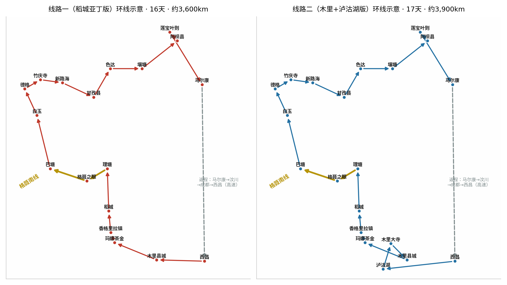
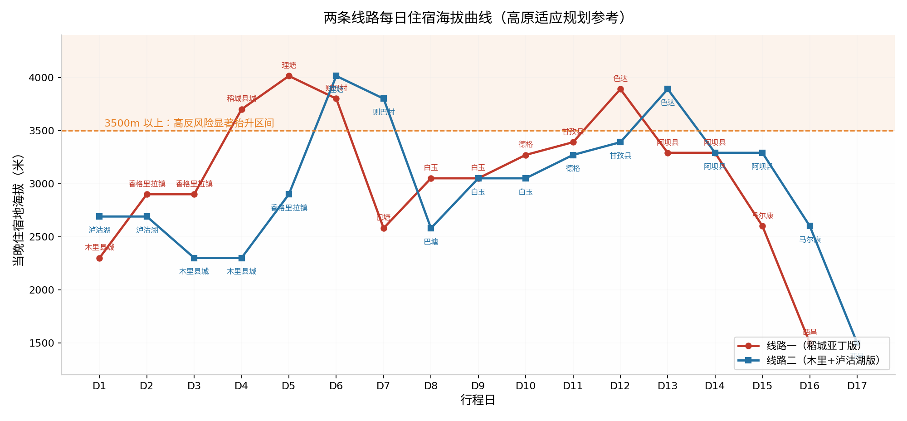
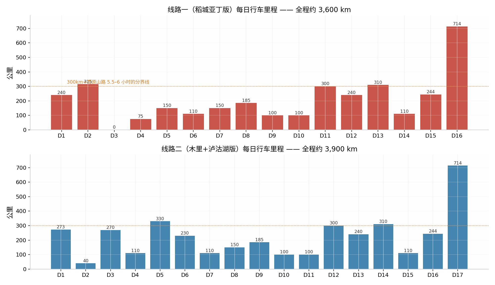

# 西昌起止·川西格聂南线双方案自驾深度规划（15 天左右）

> 两条环线均以**西昌为起止点**，共用"理塘—格聂南线—巴塘—白玉—德格—竹庆寺—甘孜—色达—莲宝叶则"这一主骨架；**线路一**在南段加入**稻城亚丁**，**线路二**以南段的**木里 + 泸沽湖**替代亚丁。线路一约 **16 天 / 3,600 公里**，线路二约 **17 天 / 3,900 公里**，均可按文末"压缩与延展方案"增减至 13—18 天。

---

## 一、双方案总览

| 对比项 | 线路一（稻城亚丁版） | 线路二（木里+泸沽湖版） |
|---|---|---|
| 总天数 | **16 天**（可压至 14、延至 18） | **17 天**（可压至 15、延至 18） |
| 总里程 | 约 **3,600 km** | 约 **3,900 km** |
| 南段特色 | 亚丁三神山、牛奶海、五色海、珍珠海、海子山古冰川遗迹 | 泸沽湖环湖、木里大寺、康坞大寺、寸冬海子、玛娜茶金远眺亚丁三神山 |
| 北段（两线相同） | 理塘→格聂南线→巴塘→白玉（噶陀寺）→德格（印经院）→竹庆寺→新路海→甘孜→色达→壤塘→阿坝县（莲宝叶则、各莫寺、朗依寺） | 同左 |
| 最高住宿点 | 理塘 4,014 m | 理塘 4,014 m |
| 难度最高路段 | 格聂南线（约 30 km 非铺装炮弹坑路） | 泸沽湖—木里段 + 格聂南线 |
| 车辆要求 | 四驱 SUV 起步，硬派越野最佳 | 同左 |
| 最佳季节 | **9 月中—10 月中**（金秋）、6 月（花海）；7—8 月雨季慎行，11—4 月亚丁长线封闭 | 同左（玛娜茶金冬季冰雪需防滑链） |
| 适合人群 | 首次进川西、想要"大 IP 全集"的人 | 偏爱小众秘境、愿意用亚丁换"人少+摩梭文化+木里王国"的人 |

---

## 二、路线设计的六条逻辑

看懂这几条，后面的每一天为什么要这么排就清楚了。

**1. 海拔阶梯式爬升，把 4,000 米以上的住宿尽量往后推。** 两条线的前两晚都安排在 2,300—2,900 m（木里县城约 2,300 m、香格里拉镇 2,900 m、泸沽湖 2,690 m），第 4—6 天才进入稻城 3,700 m、理塘 4,014 m。格聂南线平均海拔 4,000 m 以上、最高垭口超 5,000 m，必须先适应再进入 [(网易)](https://www.163.com/dy/article/L0TS8S4A0556NG0H.html) 。全线只有理塘、则巴村、色达三晚在 3,800 m 以上，且都出现在行程中段——那时身体已经完成高原适应。

**2. 北段主骨架是一条"不走回头路"的顺流环线。** 理塘（G318）→格聂南线（S459）→巴塘→沿 G215 北上白玉→G215/G317 到德格→S456 竹庆寺→G317 经新路海到甘孜县→北上色达→东出壤塘到阿坝县→马尔康方向返程。巴塘到白玉的 185 公里走的是 G215 接甘白路，约 4 小时 45 分 [(太平洋汽车)](https://www.pcauto.com.cn/jxwd/3615/36150240.html) ；白玉到德格约 100 公里 2 小时，完全顺路。

**3. 把"预约型景点"固定在行程后半段，留出改签弹性。** 色达五明佛学院目前实行网络预约限流，需提前在"喇荣沟进沟预约"小程序抢票 [(微信公众平台)](http://mp.weixin.qq.com/s?__biz=MjM5NDYzODc2MQ==&mid=2651095168&idx=1&sn=3989a87768e0af393ea2f71cbcda2f35) ；稻城亚丁旺季也建议提前购票。把它们排在 D12 前后，万一没约到，前后各有一天的缓冲可以调换。

**4. 格聂南线放在"亚丁之后、巴塘之前"，体力分配最优。** 如果走亚丁长线（徒步 7—8 小时），第二天短线下撤后只剩半天车程到稻城，再用一天缓到理塘，进入格聂南线时体力已恢复；且格聂南线全程无加油站、80% 路段无手机信号 [(网易)](https://www.163.com/dy/article/L0TS8S4A0556NG0H.html) ，理塘是进山前最后一个可靠补给点。

**5. 南段利用 2024 年 6 月全线贯通的 G227 麦巴段。** 木里至稻城香格里拉镇的里程因此缩短约 100 公里、节省 2.5 小时，现约 315 公里、5.5 小时可达 [(汽车之家)](https://www.autohome.com.cn/ask/23329902.html) 。这让"西昌→木里→亚丁"两天直达成为可能，也是线路二"泸沽湖—木里—玛娜茶金—理塘"顺畅衔接的关键。

**6. 返程走"阿坝县→马尔康→成都→西昌"高速走廊收尾。** 阿坝县到马尔康约 244 公里、4.5 小时 [(bestunion.cn)](http://m.bestunion.cn/router/%E9%98%BF%E5%9D%9D%E5%8E%BF_%E9%A9%AC%E5%B0%94%E5%BA%B7%E5%8E%BF.html) ；马尔康到西昌约 714 公里、10 小时（汶马高速+都汶+成都绕城+成雅+雅西） [(车主指南)](https://www.icauto.com.cn/route/867_844.html) 。最后一天是全程最苦的高速日，但前面 14—15 天已经把体力型景点全部消化完，纯赶路收尾最合理。若想轻松些，可改走"壤塘—炉霍—道孚—康定—西昌"三天景观返程（见第十节）。

---

## 三、线路一：稻城亚丁版（16 天）

### 3.1 逐日行程表

| 日 | 路线 | 里程/车程 | 当晚住宿（海拔） | 当日核心 |
|---|---|---|---|---|
| D1 | 西昌→盐源→木里县城 | 240 km / 5 h | 木里县城（2,300 m） | 雅砻江峡谷、适应海拔 |
| D2 | 木里→G227→（玛娜茶金）→香格里拉镇 | 315 km / 6 h | 香格里拉镇（2,900 m） | G227 最美国道、远眺三神山 |
| D3 | 亚丁景区**长线** | 景区内 | 香格里拉镇（2,900 m） | 洛绒牛场、牛奶海、五色海 |
| D4 | 亚丁景区**短线**→稻城 | 75 km / 1.5 h | 稻城县城（3,700 m） | 冲古寺、珍珠海、尊胜塔林 |
| D5 | 稻城→兴伊措/海子山→理塘 | 150 km / 3 h | 理塘（4,014 m） | 兔儿山、长青春科尔寺、勒通古镇 |
| D6 | 理塘→铁匠山→格聂之眼→冷古寺→则巴村 | 约 110 km | 则巴村（3,800 m） | 格聂南线北段精华 |
| D7 | 则巴村→夯达/热梯河谷→巴塘 | 约 150 km | 巴塘（2,580 m） | 格聂南线穿越、南坡冰川 |
| D8 | 巴塘→盖玉（巴巴海）→白玉 | 185 km / 5 h | 白玉县城（3,050 m） | 巴巴沟蓝松湖、金沙江峡谷 |
| D9 | 白玉→噶陀寺→白玉寺→白玉 | 约 100 km | 白玉县城（3,050 m） | 宁玛派母寺噶陀寺、白玉寺 |
| D10 | 白玉→德格 | 100 km / 2 h | 德格县城（3,270 m） | 德格印经院、更庆寺 |
| D11 | 德格→马尼干戈→竹庆寺→新路海→甘孜 | 约 300 km / 6 h | 甘孜县城（3,390 m） | 佐钦寺、玉龙拉措、雀儿山 |
| D12 | 甘孜→金马草原→东嘎寺→色达 | 240 km / 4 h | 色达县城（3,890 m） | 东嘎寺、五明佛学院（下午场） |
| D13 | 色达→壤塘→阿坝县 | 310 km / 5.5 h | 阿坝县城（3,290 m） | 壤塘藏寨、草原风光 |
| D14 | 阿坝县→莲宝叶则→各莫寺→阿坝县 | 约 110 km | 阿坝县城（3,290 m） | 扎尕尔措、4520 观景台、各莫寺 |
| D15 | 阿坝县→红原→马尔康 | 244 km / 4.5 h | 马尔康（2,600 m） | 红原草原、卓克基官寨（可选） |
| D16 | 马尔康→汶川→成都→西昌 | 714 km / 10 h | 西昌（1,500 m） | 高速返程日 |

### 3.2 逐日详解

**D1 西昌→木里县城（240 km，约 5 小时）**。沿 G348 经盐源县进入木里，西昌至盐源约 140 公里路况平缓，过盐源后翻磨盘山垭口，海拔升至 3,000 m 以上，沿途是雅砻江峡谷与原始森林 [(汽车之家)](https://www.autohome.com.cn/ask/23332872.html) 。盐源县城是全程最稳妥的加油补给点，建议在此加满油、吃午饭。木里县城乔瓦镇海拔约 2,300 m，是第一晚理想的适应点。若出发早，下午可顺访县城附近的寺庙与藏家集市，早点休息。

**D2 木里→香格里拉镇（315 km，约 6 小时）**。全天行驶在刚贯通不久的 G227 麦巴段——这条"中国三大最美国道"之一的段落串联起木里大寺、玛娜茶金观景台与稻城亚丁 [(微信公众平台)](http://mp.weixin.qq.com/s?__biz=MzA5NTgzMjQzMA==&mid=2658470979&idx=1&sn=5f9394920ac4e0b3f7f8a6e4b4da510d) 。出木里约 140 公里处有玛娜茶金观景台岔路（支路约 12—13 公里），海拔 4,380 m，可无遮挡平视亚丁三神山（仙乃日、央迈勇、夏诺多吉），最近直线距离仅 15 公里 [(搜狐)](https://www.sohu.com/a/812793717_120952561) 。体力与时间允许强烈建议上去（往返加游览多留 1.5—2 小时）；注意观景台附近无加油站，最近的加油点在 25.8 公里外，出木里前务必满油 [(搜狐)](https://www.sohu.com/a/812793717_120952561) 。傍晚抵香格里拉镇（日瓦，2,900 m），这里是亚丁景区的门户，食宿条件最好、海拔最低，连住两晚 [(Trip.com)](https://hk.trip.com/moments/destination-daocheng-yading-2141912/) 。

**D3 亚丁长线（景区内，住香格里拉镇）**。门票旺季 146 元（4 月 1 日后）/淡季 120 元，观光车 120 元必购，门票两日有效 [(Trip.com)](https://hk.trip.com/moments/destination-daocheng-yading-2141912/) 。路线：游客中心→观光车 1 小时至扎灌崩→步行 300 m 至冲古寺→电瓶车（往返 80 元，建议乘坐）至洛绒牛场→徒步/骑马（约 300 元，限量）→舍身崖→"绝望坡"→牛奶海（4,500 m）→五色海（4,700 m） [(Trip.com)](https://hk.trip.com/moments/destination-daocheng-yading-2141912/) 。全程徒步约 7—8 小时，**务必 7:30 前抵达景区、13:00 前从牛奶海下撤**；下午 3 点后不再放行上山 [(Trip.com)](https://hk.trip.com/moments/destination-daocheng-yading-2141912/) 。**特别注意：长线（金刚挑战线）每年冬春封闭，2025—2026 年度封闭期为 2025 年 11 月 24 日—2026 年 4 月 15 日**，期间只能走中线与短线 [(513337.com)](https://www.513337.com/tourism/news/25636.html) 。

**D4 亚丁短线→稻城县城（75 km，住稻城 3,700 m）**。上午二进景区（次日凭照片免票入园、观光车半价 [(马蜂窝)](https://www.mafengwo.cn/gonglve/ziyouxing/248863.html) ），走观音慈悲线：冲古寺→珍珠海（卓玛拉措，4,100 m），拍仙乃日倒影，木栈道往返约 3 小时、强度温和 [(9sc.cn)](https://9sc.cn/sichuan/26353.html) 。中午出景区，翻波瓦山（4,500 m 垭口）返稻城县城，途中看尊胜塔林（1 座主塔+108 座小塔）、傍河杨林 [(马蜂窝)](https://www.mafengwo.cn/gonglve/ziyouxing/248863.html) 。这一天刻意安排轻松，是对前一天高强度徒步的恢复日。

**D5 稻城→理塘（150 km，约 3 小时，住理塘 4,014 m）**。沿 S217 北上，途经桑堆红草地（10 月初最佳）、兔儿山垭口（4,696 m）、海子山古冰川遗迹；时间充裕可拐去兴伊措——海子山最大的湖泊、稻城河源头，其中有一段颠簸路段 [(云南段】)](http://lxmxj.com/sys-nd/99.html) 。理塘到稻城一线全程柏油路，理塘至海子山为草原公路，海子山弯多路窄注意会车 [(马蜂窝)](https://www.mafengwo.cn/gonglve/ziyouxing/248863.html) 。下午游览**长青春科尔寺**（理塘寺，1580 年由三世达赖开光，康区第一大格鲁派寺庙，免费）和**勒通古镇·千户藏寨**（4A 景区，免费，内有七世达赖故居仁康古屋与微型博物馆群） [(ctrip.com)](https://gs.ctrip.com/html5/you/article/detail/28490023.html) 。傍晚可开车上东山顶俯瞰"天空之城"全景 [(ctrip.com)](https://gs.ctrip.com/html5/you/article/detail/65166032.html) 。**理塘 4,014 m 是全程最高住宿点，今晚不要洗澡、不要饮酒。**

**D6 理塘→格聂之眼→冷古寺→则巴村（约 110 km，住则巴村 3,800 m）**。正式进入**格聂南线**（S459）。出理塘翻铁匠山垭口（4,770 m），看铁匠山巨石与海子；经拉则垭口观景台，格聂、肖扎、喀麦隆、库日岗中诸峰一字排开 [(欣欣文旅产业平台)](https://m.cncn.net/blog/1354412) 。随后到然日卡村（丁真家乡，村口有野温泉），依次看**格聂之心**与**格聂之眼**——直径约 30 米的圆形海子，水草围成"瞳孔"，无人机视角如大地之眸，清晨 6:00—7:30 无风时倒影最佳 [(搜狐)](https://www.sohu.com/a/1042961477_121124406) 。下午访**新冷古寺**（车可直达，藏有"格聂三宝"：格聂之心奇石、母鹿角、反转海螺），体力好可徒步 4 公里进老冷古寺 [(搜狐)](https://www.sohu.com/a/1024038619_442223) 。傍晚到则巴村，这里正对格聂南坡冰川，是拍日照金山的位置 [(搜狐)](https://www.sohu.com/a/1042961477_121124406) 。**今日起进入无信号、无加油站区域，进山前在理塘加满油、下载离线地图、在格聂镇防火卡点登记** [(网易)](https://www.163.com/dy/article/L0TS8S4A0556NG0H.html) 。

**D7 则巴村→热梯河谷→巴塘（约 150 km，住巴塘 2,580 m）**。清晨可选徒步或骑马去看格聂雪山下的"一棵树"（海拔爬升至 4,500 m，往返约 3 小时，不想走可乘车到则巴村骑马点） [(欣欣文旅产业平台)](https://m.cncn.net/blog/1354412) 。随后沿格聂南线精华段南下，经夯达营地（直面格聂南坡）、热梯河谷花海（6—8 月），穿越 30 公里左右的炮弹坑、碎石与涉水路段——这是全程对车辆要求最高的一天，**两驱轿车和普通城市 SUV 不要尝试，需四驱高底盘车型** [(新浪)](https://k.sina.com.cn/article_7879923029_1d5ae155506801ewb4.html) 。傍晚抵巴塘（2,580 m），海拔骤降 1,200 多米，可以好好洗个澡休整。若多一天预算，次日可加**措普沟**（巴塘以北约 110 公里 G318 方向，门票+观光车约 190 元，集雪山湖泊温泉于一体，需一整天） [(Trip.com)](https://hk.trip.com/moments/poi-cuopu-valley-scenic-area-98118/) 。

**D8 巴塘→白玉（185 km，约 5 小时，住白玉 3,050 m）**。沿 G215 接甘白路北上，约 4 小时 45 分 [(太平洋汽车)](https://www.pcauto.com.cn/jxwd/3615/36150240.html) 。中途在**盖玉镇**拐入火龙沟自然保护区，探访**巴巴沟蓝松湖**——纯净"克莱因蓝"的高山海子，免费，但最后约 15 分钟为石子路，**仅建议四驱车/SUV 前往，轿车勿入** [(Trip.com)](https://tw.trip.com/moments/poi-babagou-blue-pine-lake-145525605/) 。这一天穿越金沙江支流峡谷，森林、藏寨与经幡相伴，傍晚抵白玉县城。

**D9 白玉：噶陀寺 + 白玉寺（约 100 km 往返，住白玉）**。上午驱车约 50 公里（最后 8 公里盘山路弯多）上**噶陀寺**——1159 年创建，宁玛派六大金刚道场中最著名的一座，堪称"宁玛派母寺"，莲花生大师曾亲自开光十三次，故又称"第二金刚座"；寺内文武百尊坛城与十明佛学院规模惊人 [(手机网易网)](https://m.163.com/dy/article/K7J90FQJ055685MQ.html) 。多数攻略写海拔 4,800 m，实测约 3,800—4,000 m [(yoojia.com)](https://www.yoojia.com/article/8916557719129863512.html) 。噶陀寺**免费开放**，寺内可住简易床位，珍宝殿文物需僧人带领参观、禁止拍摄 [(youxiake.com)](https://bbs.youxiake.com/mdd/7054.html) 。下午回县城参观**白玉寺**——康区三大宁玛派寺庙之一（另两座即噶陀寺与德格竹庆寺），德格土司五大家庙之一 [(搜狐)](https://www.sohu.com/a/901557716_121488442) 。今日是全程人文浓度最高的一天，建议请寺内僧人讲解。

**D10 白玉→德格（100 km，约 2 小时，住德格 3,270 m）**。车程轻松，中午前抵达。**德格印经院**就在县城更庆镇：始建于 1729 年，藏区三大印经院之首，保存 32 万余块木刻经版、830 余种典籍，门票 50 元 [(Trip.com Singapore)](https://sg.trip.com/moments/detail/dege-3140-142873249?locale=zh-SG) 。**开放时间为上午 9:00—11:30、下午 14:30—17:30，中午关门**，院内靠自然光作业、全程顺时针参观、不可随意拍照 [(Trip.com Singapore)](https://sg.trip.com/moments/detail/dege-3140-142873249?locale=zh-SG) 。参观 1.5—2 小时后，顺路上行就是**更庆寺**（免费）——康区萨迦派主寺、德格土司家庙，以"德格藏戏"闻名，寺后大片废墟可见昔日规模 [(Trip.com)](https://hk.trip.com/hot/travel-itinerary/%E5%BE%B7%E6%A0%BC+%E8%A1%8C%E7%A8%8B+%E8%A6%8F%E5%8A%83+3%E6%97%A52%E5%A4%9C.html) 。

**D11 德格→竹庆寺→新路海→甘孜县（约 300 km，约 6 小时，住甘孜 3,390 m）**。沿 G317 东行约 110 公里到马尼干戈，拐 S456 北行约 50 公里到竹庆乡，访**竹庆寺（佐钦寺）**——1684 年由第一世佐钦法王白玛仁增创建，宁玛派六大母寺之一、大圆满法的修证中心，分寺近三百座遍布海内外；寺院红墙金顶、佛学堂宏伟，大广场与尼泊尔风格白塔很有辨识度 [(百度百科)](https://baike.baidu.com/item/%E4%BD%90%E9%92%A6%E5%A4%A7%E5%9C%86%E6%BB%A1%E5%AF%BA/510313) 。返回马尼干戈后，在雀儿山隧道口附近看**新路海（玉龙拉措）**——雀儿山冰川融水汇成的冰蚀湖，"玉是心，龙是倾，拉措是神湖"，湖边百年云杉林倒映湖面 [(xibeitechan.com)](http://xibeitechan.com/wiki/17369.html) 。随后穿雀儿山隧道，傍晚抵甘孜县。若觉得赶，可在马尼干戈拆成两天。

**D12 甘孜→色达（240 km，约 4 小时，住色达县城 3,890 m）**。沿 G317 转 G548，穿越金马草原，途经炉霍。午后抵色达，先顺访**东嘎寺**（宁玛派名寺，县城以东约 20 分钟车程）与金马草原 [(欣欣旅游网)](https://m.cncn.com/xianlu/813814997220) 。按预约时段（建议下午场 13:30—18:00）前往**喇荣五明佛学院**：在金马旅游集散中心统一乘大巴（48 元；洛若集散中心 30 元）进入，每日限流（2025 年实测每日仅约 500 个名额），沟内停留约 90 分钟 [(微信公众平台)](http://mp.weixin.qq.com/s?__biz=MjM5NDYzODc2MQ==&mid=2651095168&idx=1&sn=3989a87768e0af393ea2f71cbcda2f35) 。**务必提前在"喇荣沟进沟预约"小程序抢票（每日 0 点放票），旺季建议提前 3 天** [(网易)](https://www.163.com/dy/article/K19N367605560ABS.html) 。也有 180 元的"色达全域旅游直通车"产品，含东嘎寺、金马草原、喇荣沟三段 [(欣欣旅游网)](https://m.cncn.com/xianlu/813814997220) 。佛学院海拔 4,000—4,100 m，坛城转经请顺时针，不拍僧人正面、禁飞无人机。

**D13 色达→阿坝县（310 km，约 5.5 小时，住阿坝县 3,290 m）**。经壤塘县东出，沿途有猴群出没可备些水果，中午可在壤塘看曾克寺 [(马蜂窝)](https://www.mafengwo.cn/i/24480133.html?static_url=true) 。全天是草原+峡谷的过渡日，傍晚抵阿坝县。若时间富裕，可在壤塘多停半天看觉囊派寺庙群（中壤塘）。

**D14 阿坝县：莲宝叶则 + 各莫寺（约 110 km，住阿坝县）**。早起先去**莲宝叶则·石头山风景区**（县城到景区约 45 公里、1 小时）：门票旺季 120 元（4—11 月）/淡季 60 元，**目前无观光摆渡车，购票后自驾进入**，从大门到最高观景台约 25 公里 [(anlvw.com)](https://www.anlvw.com/post/133716.html) 。核心看**扎尕尔措**（翡翠色湖水嵌在刀劈石峰间，沿 1.5 公里栈道环湖，早晨 9 点前光线最佳）与**4520 观景台**（盘羊坪电瓶车往返 15 元或徒步 1.4 公里，俯瞰千湖万峰） [(Trip.com)](https://hk.trip.com/moments/detail/aba-county-1446246-137565387/) 。下午回程顺访**各莫寺**（参观时间 9:00—12:00、14:00—18:00，寺内禁拍，拥有获吉尼斯纪录的弥勒殿） [(豆瓣)](https://www.douban.com/group/topic/308151130/) ，傍晚到**朗依寺**后山看日落——这是国内最大的雍仲本教寺院 [(jinsefu.com)](http://www.jinsefu.com/photoinfo.aspx?id=542&nid=2156) 。阿坝县海拔约 3,290 m，是全程最后一个舒适补给点。

**D15 阿坝县→马尔康（244 km，约 4.5 小时，住马尔康 2,600 m）**。经 S302/S209 穿红原草原南下 [(bestunion.cn)](http://m.bestunion.cn/router/%E9%98%BF%E5%9D%9D%E5%8E%BF_%E9%A9%AC%E5%B0%94%E5%BA%B7%E5%8E%BF.html) ，夏季可在红原看花海、月亮湾。下午到马尔康，可选看卓克基土司官寨，好好吃一顿、早睡，为最后一天蓄力。

**D16 马尔康→西昌（714 km，约 10 小时）**。汶马高速→都汶高速→成都绕城→成雅→雅西高速返西昌 [(车主指南)](https://www.icauto.com.cn/route/867_844.html) 。全程高速为主但里程长，**建议两名司机轮换、7:00 前出发**，中午在成都或雅安休整。想轻松可拆成两天（马尔康→成都→西昌），或改走康定景观线（见第十节）。

---

## 四、线路二：木里 + 泸沽湖版（17 天）

不进亚丁景区，改为环泸沽湖、深入"木里王国"，并在玛娜茶金以平视角度无遮挡远眺亚丁三神山——人少得多，体验更野。D6 起与线路一完全重合（理塘→格聂南线→巴塘→白玉→德格→竹庆寺→甘孜→色达→阿坝县→马尔康→西昌），重合段落的每日细节请参照第三节，此处仅列简表。

### 4.1 南段差异部分（D1—D5）详解

**D1 西昌→泸沽湖（273 km，约 5—7 小时，住大落水/里格，2,690 m）**。经盐源翻磨盘山抵达四川侧泸沽湖，自驾约 5—7 小时 [(马蜂窝)](https://www.mafengwo.cn/wenda/detail-1327646.html) 。景区门票为湖区通票 70 元 [(Klook Travel)](https://www.klook.com/zh-HK/blog/lugu-lake/) 。傍晚在大落水村看湖、吃摩梭石板烧，早点休息。

**D2 泸沽湖环湖一日（约 40 km，住泸沽湖）**。环湖约 60—70 公里，推荐：清晨**里格半岛**日出（里格观景台拍全景，8 点前到避开人流）→乘**猪槽船**游湖（大落水码头往返里务比岛 65 元/人）→**草海·走婚桥**（傍晚光影最佳）→**女神湾**日落（小众、湖面如镜） [(sina.cn)](https://cj.sina.cn/articles/view/7857141524/1d452771401903aros?froms=ggmp) 。体力好可加**格姆女神山索道**（110 元/人，海拔 3,700 m 俯瞰全湖，索道约 17:00 停运） [(Klook Travel)](https://www.klook.com/zh-HK/blog/lugu-lake/) 。晚上可看摩梭篝火晚会。泸沽湖海拔 2,690 m，两天停留是绝佳的高原适应期。

**D3 泸沽湖→屋脚→木里大寺→木里县城（约 270 km，约 6.5 小时，住木里县城 2,300 m）**。走泸亚线东段：泸沽湖→前所乡→屋脚蒙古族乡→瓦厂镇，顺访**木里大寺**——始建于 1656 年、历时三百多年建成的"木里喇嘛王国"政教中心，康区最大的格鲁派寺院之一，弥勒殿内供 20 余米高的甲娃强巴（弥勒）铜佛，1713 年铸，佛体内贮五世班禅所赐舍利等圣物 [(携程攻略)](https://you.ctrip.com/sight/muli3100/1416247.html) 。过豹子坪后西行抵木里县城。**注意：此段为典型泸亚线山路——弯急、临崖、部分砂石路，需高底盘车辆与山路经验，雨季慎行** [(携程攻略)](https://you.ctrip.com/travels/Danba704/4172476.html) 。不想走这段烂路的替代方案：泸沽湖→盐源→G348→木里县城（约 300 公里，路况好但少了木里大寺）。

**D4 木里县城→康坞大寺→寸冬海子→木里县城（约 110 km，住木里县城）**。上午**康坞大寺**（县城约 30 公里，免费）——依山而建、殿堂错落，经幡边廊与森林环绕，壁画精美 [(搜狐)](https://www.sohu.com/a/890299970_188450) 。随后**寸冬海子（香格里拉湖/长海子）**（县城约 38 公里、1 小时，柏油路，免费）——湖中有数千座漂浮草甸，形成独有的"千岛之湖"，下午 4—6 点光线柔和时最美 [(搜狐)](https://www.sohu.com/a/890299970_188450) 。时间充裕还可加丁冬海子（县城 43 公里，一半乡道，湖色随光线变幻） [(搜狐)](https://www.sohu.com/a/890299970_188450) 。今天是全程最轻松的一天，用来恢复。

**D5 木里县城→G227→玛娜茶金→香格里拉镇（约 330 km，约 6 小时，住香格里拉镇 2,900 m）**。沿 G227 北上，过 915 林场后拐 12—13 公里支路上**玛娜茶金观景台**（海拔约 4,300—4,380 m，免费）——"玛娜茶金"意为"母山旁的广阔草场"，在此可无遮挡平视亚丁三神山，最近直线距离仅 15 公里，是日出、日照金山与云海的绝佳机位，也是当年洛克考察的核心区 [(网易)](https://www.163.com/dy/article/KS8ISFSE0519FRSC.html) 。随后翻巴亨垭口（4,200 m），经蒙自大峡谷、俄牙同抵香格里拉镇 [(汽车之家)](https://www.autohome.com.cn/ask/23329902.html) 。**上观景台务必在木里县城加满油**（观景台附近最近加油站 25.8 公里外），冬季冰雪需四驱+防滑链 [(搜狐)](https://www.sohu.com/a/812793717_120952561) 。不进亚丁景区，晚上在镇上吃顿好的，明天直插理塘。

**D6 香格里拉镇→稻城→理塘（230 km，约 4 小时，住理塘 4,014 m）**。翻波瓦山，经稻城县城（尊胜塔林、傍河杨林）、桑堆红草地、兔儿山（4,696 m）、海子山，可选拐兴伊措 [(马蜂窝)](https://www.mafengwo.cn/gonglve/ziyouxing/248863.html) 。下午游览长青春科尔寺与勒通古镇·千户藏寨 [(ctrip.com)](https://gs.ctrip.com/html5/you/article/detail/28490023.html) 。

### 4.2 重合段（D7—D17）简表

| 日 | 路线 | 里程/车程 | 住宿（海拔） | 核心 |
|---|---|---|---|---|
| D7 | 理塘→格聂之眼→冷古寺→则巴村 | 约 110 km | 则巴村（3,800 m） | 格聂南线北段 |
| D8 | 则巴村→热梯河谷→巴塘 | 约 150 km | 巴塘（2,580 m） | 格聂南线穿越 |
| D9 | 巴塘→盖玉（巴巴海）→白玉 | 185 km / 5 h | 白玉（3,050 m） | 蓝松湖、金沙江峡谷 |
| D10 | 白玉→噶陀寺→白玉寺→白玉 | 约 100 km | 白玉（3,050 m） | 噶陀寺、白玉寺 |
| D11 | 白玉→德格 | 100 km / 2 h | 德格（3,270 m） | 印经院、更庆寺 |
| D12 | 德格→竹庆寺→新路海→甘孜 | 约 300 km / 6 h | 甘孜县（3,390 m） | 佐钦寺、玉龙拉措 |
| D13 | 甘孜→东嘎寺→色达佛学院 | 240 km / 4 h | 色达（3,890 m） | 佛学院下午场 |
| D14 | 色达→壤塘→阿坝县 | 310 km / 5.5 h | 阿坝县（3,290 m） | 草原过渡日 |
| D15 | 阿坝县→莲宝叶则→各莫寺→阿坝县 | 约 110 km | 阿坝县（3,290 m） | 扎尕尔措、4520 观景台 |
| D16 | 阿坝县→马尔康 | 244 km / 4.5 h | 马尔康（2,600 m） | 红原草原 |
| D17 | 马尔康→西昌 | 714 km / 10 h | 西昌 | 高速返程 |

> **压缩提示**：线路二若想压到 15 天，可将 D3—D4 合并（泸沽湖→木里大寺→当天赶到木里县城，放弃康坞大寺与寸冬海子或只取其一），并将 D16—D17 按第十节的"马尔康直达西昌"执行；想更从容则反向加一天给玛娜茶金露营拍星空或给壤塘。

---

## 五、核心目的地深度指南

### 5.1 格聂南线：全程的"技术顶点"

格聂南线是连接理塘与巴塘的顶级穿越路线，浓缩了横断山脉的雪山、花海、河谷与古寺 [(搜狐)](https://www.sohu.com/a/1024038619_442223) 。**关键事实**：格聂神山海拔 6,204 m，为四川第三高峰、藏区 24 座神山第 13 座"女神" [(搜狐)](https://www.sohu.com/a/1024038619_442223) ；全线约 250 公里，约 80% 柏油路 + 30 公里炮弹坑碎石路，中后段（惹迪—则巴村、热梯河谷一带）路况最差 [(Trip.com)](https://tw.trip.com/moments/theme/poi-city-134565282-hiking-990133/) ；**全程无加油站，60%—80% 路段无手机信号**，进山前必须在理塘或巴塘加满油、下载离线地图 [(网易)](https://www.163.com/dy/article/L0TS8S4A0556NG0H.html) 。

**分段玩法**：北段（理塘—铁匠山—格聂之眼—冷古寺）以观景为主，新冷古寺道路已硬化、轿车亦可抵达，但格聂之眼与热梯河谷必须走土路 [(新浪)](https://k.sina.com.cn/article_7879923029_1d5ae155506801ewb4.html) ；中段（格聂镇—则巴村—一棵树）是花海与冰川核心区；南段（夯达—巴塘）为精华穿越段。**官方安全要求**：徒步活动须在格聂镇防火卡点备案登记，严禁单人无向导进入，露营须在夯达营地、伊拉卡房车营地等指定营地 [(搜狐)](https://www.sohu.com/a/1024038619_442223) 。最佳季节 5—10 月，其中 6 月中—7 月草甸花海最盛，9—10 月晴天率高、易见日照金山；11 月—次年 3 月垭口积雪结冰不建议前往 [(网易)](https://www.163.com/dy/article/L0TS8S4A0556NG0H.html) 。

### 5.2 稻城亚丁：长短线怎么排

亚丁门票+观光车两日有效，正确打开方式是"一天长线、一天短线" [(马蜂窝)](https://www.mafengwo.cn/gonglve/ziyouxing/248863.html) 。**长线**（金刚挑战线）洛绒牛场—牛奶海—五色海，徒步往返约 10 公里、7—8 小时，最高 4,700 m，是高反重灾区，必须早进早撤 [(来源)](https://www.tripbok.com/scenic/sichuanchuanxi-O8rmS7) ；**短线**（观音慈悲线）冲古寺—珍珠海，木栈道往返约 3 公里、3 小时，坡度缓，适合适应日 [(来源)](https://www.tripbok.com/scenic/sichuanchuanxi-O8rmS7) 。冬春（2025.11.24—2026.4.15）长线封闭，期间门票下调至 120 元，仅中线、短线开放 [(513337.com)](https://www.513337.com/tourism/news/25636.html) 。住宿首选香格里拉镇（2,900 m），比亚丁村（4,060 m）友好得多 [(Trip.com)](https://hk.trip.com/moments/destination-daocheng-yading-2141912/) 。

### 5.3 色达：预约是唯一门槛

五明佛学院不设传统门票，但**必须网络预约+统一乘车**：在"喇荣沟进沟预约"小程序提前抢名额（每日 0 点放票），按预约时段到集散中心乘大巴进入，金马集散中心车票 48 元、洛若 30 元，沟内停留约 90 分钟；2025 年实测每日限约 500 人 [(微信公众平台)](http://mp.weixin.qq.com/s?__biz=MjM5NDYzODc2MQ==&mid=2651095168&idx=1&sn=3989a87768e0af393ea2f71cbcda2f35) 。60 岁以上需签健康承诺书，学院内禁止过夜 [(网易)](https://www.163.com/dy/article/K19N367605560ABS.html) 。**拍摄纪律**：不拍僧人正面、不进大殿拍摄、禁飞无人机；天葬台区域严禁拍摄 [(重庆中国青年旅行社)](https://www.ytszg.com/sichuan/r2444.html) 。县城可顺访东嘎寺与金马草原，也有 180 元的全域旅游直通车打包三处 [(欣欣旅游网)](https://m.cncn.com/xianlu/813814997220) 。

### 5.4 宁玛派三大寺：噶陀寺、竹庆寺（+白玉寺）

这三座寺构成本线的人文脊梁。宁玛派六大母寺为西藏的多吉扎寺、敏珠林寺，与朵康的**噶陀寺、白玉寺、佐钦寺、协庆寺** [(百度百科)](https://baike.baidu.com/item/%E4%BD%90%E9%92%A6%E5%A4%A7%E5%9C%86%E6%BB%A1%E5%AF%BA/510313) 。**噶陀寺**（1159 年）是宁玛之源、"第二金刚座"，八百年间虹化成就者十万之众，文武百尊坛城为六层金顶，免费 [(手机网易网)](https://m.163.com/dy/article/K7J90FQJ055685MQ.html) ；**竹庆寺/佐钦寺**（1684 年）是大圆满法教授传承发源地，曾主导全宁玛派戒律授受，分寺近三百座，麦彭仁波切、巴珠仁波切皆出于此 [(百度百科)](https://baike.baidu.com/item/%E4%BD%90%E9%92%A6%E5%A4%A7%E5%9C%86%E6%BB%A1%E5%AF%BA/510313) ；**白玉寺**与噶陀寺同属康区三大宁玛派寺庙、德格土司五大家庙 [(搜狐)](https://www.sohu.com/a/901557716_121488442) 。参观宁玛派寺院普遍免费（竹庆寺曾收 20 元），但大殿内多禁拍，进殿脱帽、顺时针、轻声 [(8264.com)](https://www.8264.com/youji/1709453-3.html) 。

### 5.5 德格印经院：看好时间再去

印经院**上午 9:00—11:30、下午 14:30—17:30 开放，中午关闭**——这是最多人扑空的点 [(Trip.com Singapore)](https://sg.trip.com/moments/detail/dege-3140-142873249?locale=zh-SG) 。参观重点是藏版库、晒经楼与印刷工坊（可预约体验拓印），全程约 1.5—2 小时，顺时针、脱帽、拍照先问僧人 [(Trip.com Singapore)](https://sg.trip.com/moments/detail/dege-3140-142873249?locale=zh-SG) 。院内 32 万块经版在自然光下作业，本身就是活态非遗。冬季常有免票 [(Trip.com Singapore)](https://sg.trip.com/moments/detail/dege-3140-142873249?locale=zh-SG) 。

### 5.6 莲宝叶则与阿坝县：留给清晨

莲宝叶则是巴颜喀拉山南段支脉、安多地区众神山之首，主峰 5,141 m，目前仅开发扎尕尔措一条沟 [(马蜂窝)](https://www.mafengwo.cn/sales/2454578.html) 。**玩法关键**：早晨 8 点前进景区，先自驾直奔最里面的盘羊坪（在河源服务站先拿自驾号），再上 4520 观景台，返程顺路玩扎尕尔措、柏香湖、落霞湖；下午 1 点湖面反光最差，勿安排拍照 [(Trip.com)](https://hk.trip.com/moments/detail/aba-county-1446246-137565387/) 。山上风大、无人机易受磁场干扰坠落，慎飞 [(豆瓣)](https://www.douban.com/group/topic/308151130/) 。县城周边各莫寺（寺内禁拍）、朗依寺（苯教，晨雾与日落机位）各值半天 [(豆瓣)](https://www.douban.com/group/topic/308151130/) 。

### 5.7 木里与玛娜茶金（线路二）

木里被称为"最后的香格里拉"，森林覆盖率 67.3% [(汽车之家)](https://www.autohome.com.cn/ask/23332872.html) 。四张王牌：**木里大寺**（1656 年，20 米强巴铜佛） [(携程攻略)](https://you.ctrip.com/sight/muli3100/1416247.html) 、**康坞大寺**（免费，森林古寺） [(搜狐)](https://www.sohu.com/a/890299970_188450) 、**寸冬海子**（漂浮草甸千岛之湖） [(搜狐)](https://www.sohu.com/a/890299970_188450) 、**玛娜茶金**（平视亚丁三神山，海拔 4,380 m，免费） [(搜狐)](https://www.sohu.com/a/812793717_120952561) 。若多一天，还可加**俄亚大村**——"鸡鸣两省五县"的纳西族蜂窝状古寨，保留活态东巴文化 [(搜狐)](https://www.sohu.com/a/812793717_120952561) 。

---

## 六、海拔曲线与每日里程

两线都把 3,500 m 以上的住宿压缩在行程中段（稻城 1 晚、理塘 1 晚、则巴村 1 晚、色达 1 晚），此前有 2—4 天的 2,300—2,900 m 适应期，此后迅速下撤到巴塘 2,580 m。这个"缓升—短驻—快降"结构是本规划高反管理的核心。

绝大多数行车日控制在 300 公里以内（高原山路约等于 5.5—6 小时），只有最后一天马尔康—西昌 714 公里为纯高速返程。线路一 D3、线路二 D2 为景区内/环湖日，几乎不开车，正好作为体能调节点。

---

## 七、车辆、路况与装备

### 7.1 车辆要求（按路段分级）

| 路段 | 路况 | 最低车辆要求 |
|---|---|---|
| 西昌—盐源—木里—G227—理塘 | 柏油国道为主，弯多临崖 | 普通 SUV/轿车均可，避免夜间行车 [(汽车之家)](https://www.autohome.com.cn/ask/23332872.html)  |
| 泸沽湖—屋脚—木里大寺（线路二） | 泸亚线东段，窄路+部分砂石 | 高底盘 SUV [(携程攻略)](https://you.ctrip.com/travels/Danba704/4172476.html)  |
| **格聂南线（理塘—巴塘）** | 约 30 km 炮弹坑+涉水+无信号 | **四驱 SUV 起步，雨季须硬派越野；两驱轿车禁入** [(新浪)](https://k.sina.com.cn/article_7879923029_1d5ae155506801ewb4.html)  |
| 巴塘—白玉—德格—甘孜—色达 | G215/G317 柏油路 | 普通车辆均可 [(太平洋汽车)](https://www.pcauto.com.cn/jxwd/3615/36150240.html)  |
| 巴巴海支路（盖玉镇） | 石子路约 15 分钟 | 四驱/SUV，轿车勿入 [(Trip.com)](https://tw.trip.com/moments/poi-babagou-blue-pine-lake-145525605/)  |
| 噶陀寺上山 | 最后 8 km 盘山路 | SUV 为宜，弯多慢行 [(Trip.com)](https://hk.trip.com/moments/theme/destination-baiyu-120485-attraction-993137/)  |
| 色达—壤塘—阿坝县 | 柏油路为主 | 普通车辆均可 [(马蜂窝)](https://www.mafengwo.cn/i/24480133.html?static_url=true)  |
| 阿坝县—马尔康—西昌 | 省道+高速 | 普通车辆均可 [(bestunion.cn)](http://m.bestunion.cn/router/%E9%98%BF%E5%9D%9D%E5%8E%BF_%E9%A9%AC%E5%B0%94%E5%BA%B7%E5%8E%BF.html)  |

**若你的车是两驱城市 SUV 或轿车**，格聂南线有两套降级方案：① 在理塘包当地四驱车/拼车走格聂南线（格聂镇有民宿与营地可接应）；② 放弃穿越，改走 G318 理塘—巴塘（途经毛垭大草原、海子山姊妹湖，全程柏油路） [(云南段】)](http://lxmxj.com/sys-nd/99.html) ，格聂之眼、冷古寺改为理塘出发的一日轻装往返（需包车到硬派越野可及处再徒步）。

### 7.2 装备与物资清单

- **车辆**：备胎、充气泵、拖车绳、防滑链（10 月后/4 月前必带）、满油策略——格聂山区与玛娜茶金方向长距离无加油站，理塘、巴塘、木里、盐源是四大加油节点 [(网易)](https://www.163.com/dy/article/L0TS8S4A0556NG0H.html) 。
- **通讯**：离线地图（两步路/奥维轨迹）、充电宝、车充；格聂南线 80% 路段无信号 [(网易)](https://www.163.com/dy/article/L0TS8S4A0556NG0H.html) 。
- **药品**：红景天（提前一周）、布洛芬、葡萄糖口服液、肠胃药、便携氧气瓶（县城约 35 元/罐）、血氧仪 [(网易)](https://www.163.com/dy/article/K19N367605560ABS.html) 。
- **衣物**：羽绒服+冲锋衣（夏季也要，昼夜温差超 20℃）、登山杖、防滑登山鞋、防晒三件套（SPF50+、墨镜、遮阳帽） [(来源)](https://www.tripbok.com/scenic/sichuanchuanxi-O8rmS7) 。
- **现金**：备 500 元左右（部分观景台电瓶车只收现金，如莲宝叶则 4520 观景台 15 元） [(Trip.com)](https://hk.trip.com/moments/detail/aba-county-1446246-137565387/) 。

---

## 八、季节选择日历

| 时段 | 景观 | 风险提示 |
|---|---|---|
| 5—6 月 | 高山杜鹃、草甸返青，性价比高 | 垭口残雪，备防滑链 [(网易)](https://www.163.com/dy/article/L0TS8S4A0556NG0H.html)  |
| 7—8 月 | 格聂花海最盛、均温舒适 | **雨季**：塌方、落石、涉水路段风险最高，格聂南线须硬派越野 [(新浪)](https://k.sina.com.cn/article_7879923029_1d5ae155506801ewb4.html)  |
| **9 月中—10 月中** | **金秋：杨林、彩林+日照金山概率最高，综合最佳** | 国庆住宿紧张，色达/亚丁提前预约 [(网易)](https://www.163.com/dy/article/L0TS8S4A0556NG0H.html)  |
| 11 月—次年 4 月 | 雪山蓝冰、人少 | **亚丁长线封闭（11.24—4.15）** [(513337.com)](https://www.513337.com/tourism/news/25636.html) ；格聂南线垭口积雪不建议 [(网易)](https://www.163.com/dy/article/L0TS8S4A0556NG0H.html) ；玛娜茶金冰雪需四驱+防滑链 [(ctrip.com)](https://gs.ctrip.com/html5/you/sight/muli3100/143166343.html) ；甘白路可能临时封山 [(Trip.com)](https://hk.trip.com/moments/poi-yarchen-temple-95415/)  |

---

## 九、门票与预约汇总

| 项目 | 费用 | 预约/注意 |
|---|---|---|
| 稻城亚丁 | 门票旺季 146 / 淡季 120 + 观光车 120 + 电瓶车 80；骑马约 300 [(Trip.com)](https://hk.trip.com/moments/destination-daocheng-yading-2141912/)  | 门票两日有效，次日凭照片免票入园、观光车半价 [(马蜂窝)](https://www.mafengwo.cn/gonglve/ziyouxing/248863.html) ；长线 11.24—4.15 封闭 [(513337.com)](https://www.513337.com/tourism/news/25636.html)  |
| 色达五明佛学院 | 无门票，大巴 48（金马）/30（洛若）元 | **必须"喇荣沟进沟预约"小程序提前抢名额，每日 0 点放票，限流** [(微信公众平台)](http://mp.weixin.qq.com/s?__biz=MjM5NDYzODc2MQ==&mid=2651095168&idx=1&sn=3989a87768e0af393ea2f71cbcda2f35)  |
| 色达全域旅游直通车 | 180 元 | 打包东嘎寺+金马草原+喇荣沟 [(欣欣旅游网)](https://m.cncn.com/xianlu/813814997220)  |
| 莲宝叶则 | 旺季 120（4—11 月）/淡季 60 元；4520 观景台电瓶车 15 元 | 无摆渡车，自驾进入 [(anlvw.com)](https://www.anlvw.com/post/133716.html)  |
| 德格印经院 | 50 元（冬季常免票） | **9:00—11:30 / 14:30—17:30，中午关闭** [(Trip.com Singapore)](https://sg.trip.com/moments/detail/dege-3140-142873249?locale=zh-SG)  |
| 措普沟（备选） | 门票+观光车约 190 元 | 巴塘往返需一整天 [(Trip.com)](https://hk.trip.com/moments/poi-cuopu-valley-scenic-area-98118/)  |
| 泸沽湖 | 通票 70 元；格姆女神山索道 110 元；猪槽船 65 元（里务比岛） | 索道约 17:00 停运 [(Klook Travel)](https://www.klook.com/zh-HK/blog/lugu-lake/)  |
| 噶陀寺 | 免费 | 珍宝殿需僧人带领、禁拍 [(youxiake.com)](https://bbs.youxiake.com/mdd/7054.html)  |
| 竹庆寺（佐钦寺） | 免费（曾收 20 元） | 大殿内禁拍 [(8264.com)](https://www.8264.com/youji/1709453-3.html)  |
| 白玉寺 / 亚青寺 / 木里大寺 / 康坞大寺 / 长青春科尔寺 / 更庆寺 / 各莫寺 / 朗依寺 / 玛娜茶金 / 巴巴海 / 寸冬海子 / 勒通古镇 | 免费 | 亚青寺觉姆岛男性禁入、禁飞无人机 [(Trip.com)](https://hk.trip.com/moments/poi-yarchen-temple-95415/)  |

**寺庙通用礼仪**：进殿脱帽摘墨镜、顺时针参观、不拍佛像与僧人正脸、不踩门槛、不随意触碰法器经幡；供养随心 [(欣欣旅游网)](https://m.cncn.com/xianlu/813814997220) 。

---

## 十、行程压缩与延展

**压缩到 13—14 天（两线通用手法）**：① 返程改为 D15 阿坝县→红原→理县（约 350 km）、D16 理县→西昌（约 600 km 高速）两天硬赶，或马尔康—西昌一天 10 小时直达 [(车主指南)](https://www.icauto.com.cn/route/867_844.html) ；② 砍 D9 白玉整日，改为巴塘→白玉途中顺访噶陀寺（半天）后继续到德格；③ 线路一砍 D4 稻城住宿，短线下山后直抵理塘（但 D4+D5 合成 260 km 山路较累）；④ 线路二砍 D4 木里休整日，康坞大寺与寸冬海子压缩进 D3 傍晚。

**延展到 18 天的加法**：① 巴塘加一天**措普沟**（温泉煮鸡蛋、雪山海子） [(Trip.com)](https://hk.trip.com/moments/poi-cuopu-valley-scenic-area-98118/) ；② 白玉加一天**亚青寺**——世界最大觉姆修行地，沿甘白路（甘孜—白玉，全程 220 公里柏油路、中国最美县道之一）往返，途经拉龙措、卓达拉山古冰川漂砾 [(Trip.com)](https://hk.trip.com/moments/poi-yarchen-temple-95415/) ；③ 返程改三天景观线：阿坝县→壤塘→炉霍→道孚（龙灯草原、墨石公园）→塔公/新都桥→康定→雅西高速回西昌；④ 线路二加一天**俄亚大村**纳西古寨 [(搜狐)](https://www.sohu.com/a/812793717_120952561) ；⑤ 理塘—甘孜之间加**新龙措卡湖**（新龙县麻日乡，距县城约 45 公里，"人间仙境九天瑶池"） [(www.尊龙凯时888)](https://www.bloobel.com/post/49412.html) 。

**两条线怎么选**：第一次走川西、想要标志性景观全集，选**线路一**；讨厌排队预约、喜欢野路和人文密度，选**线路二**——它在玛娜茶金看到的亚丁三神山视角，是亚丁景区内部反而看不到的"品"字形全景 [(网易)](https://www.163.com/dy/article/KS8ISFSE0519FRSC.html) 。若时间真的充裕（20 天+），两线也可以拼接成"泸沽湖—木里—亚丁—格聂—白玉—德格—色达—莲宝叶则"的超大环线。

---

## 十一、小众人性化个性化特别安排

### 11.1 晨曦摄影攻略（每个地点的最佳拍摄时间）

| 地点 | 最佳时间 | 拍摄要点 | 备注 |
|---|---|---|---|
| 里格半岛日出 | 6:30—7:30 | 薄雾+猪槽船剪影+湖面倒影 | 提前一天查日出时间 |
| 玛娜茶金日出 | 6:00—7:00 | 日照金山+云海 | 需提前出发，带上手电筒 |
| 格聂之眼 | 6:00—7:30 | 无风时完美倒影 | 无人机俯拍最佳 |
| 则巴村日落 | 18:30—19:30 | 格聂南坡冰川金光 | 找好机位提前等候 |
| 稻城红草地 | 10月清晨 | 金色晨雾+杨林倒影 | 10月初最佳 |
| 措普沟晨雾 | 7:00—8:00 | 雪山+湖泊+温泉蒸汽 | 需住宿景区内 |
| 莲宝叶则 | 8:00—9:00 | 晨雾未散+湖面平静 | 务必早进景区 |

### 11.2 私密观景点推荐

| 地点 | 位置 | 特色 | 到达方式 |
|---|---|---|---|
| **措普沟秘境** | 巴塘以北110km | 雪山湖泊温泉浑然一体 | G318拐入，需门票 |
| **巴巴沟蓝松湖** | 盖玉镇火龙沟 | "克莱因蓝"高原海子 | 支路约15分钟石子路 |
| **热梯河谷花海** | 则巴村以南 | 6-8月漫山野花 | 格聂南线路段 |
| **女神湾（达祖码头）** | 泸沽湖西南 | 湖面如镜，游人稀少 | 环湖路拐入 |
| **龙灯草原** | 道孚县 | 八美镇附近，彩林秘境 | G318附近 |
| **新路海** | 马尼干戈附近 | 冰川融水+云杉林 | 雀儿山隧道口附近 |
| **毛垭大草原** | G318理塘至巴塘段 | 夏季花海连绵 | 沿途停车 |

### 11.3 高原养生建议

**每日养生清单**：
- 起床后：喝一杯温水+葡萄糖
- 行车中：每2小时下车活动5分钟
- 用餐时：少油腻多蛋白质，多吃当地犏牛酸奶
- 睡前：红景天茶或高原安，高海拔日不洗澡
- 急救包：便携氧气瓶放在随手可及处

**高反信号识别**：
- 轻微：头痛、胸闷 → 休息+吸氧+布洛芬
- 中度：恶心、失眠 → 降低海拔+就医
- 重度：咳血、意识模糊 → 立即下撤+拨打120

### 11.4 文化体验特别安排

**藏传佛教寺院深度体验**：
1. **噶陀寺**：请僧人讲解宁玛派传承，参观十明佛学院
2. **竹庆寺**：了解大圆满法修行体系
3. **色达五明佛学院**：参加一次辩经（午后）
4. **长青春科尔寺**：观早课（5:00-7:00，需提前沟通）

**当地节庆参考**：
- 6月：理塘赛马节
- 8月：康定情歌节
- 10月：稻城红草地节
- 藏历新年（每年不同）：各地寺庙祈福法会

### 11.5 自驾舒适度提升技巧

| 问题 | 解决方案 |
|---|---|
| 长时间驾驶疲劳 | 每2小时换驾驶员，车载颈枕+腰靠 |
| 高原昼夜温差大 | 洋葱式穿搭，随时增减衣物 |
| 手机信号差 | 提前下载离线地图，标注沿途救援点 |
| 加油不便 | 遵循"见加油站就加满"原则 |
| 饮食不习惯 | 随身带榨菜、老干妈，自热米饭备着 |
| 住宿条件有限 | 带上隔脏睡袋和便携洗漱包 |

### 11.6 美食地图

| 地点 | 推荐美食 | 店铺/地点 |
|---|---|---|
| 盐源 | 盐源苹果、花椒 | 县城集市 |
| 泸沽湖 | 摩梭石板烧、烤鱼 | 大落水村沿湖餐厅 |
| 木里 | 藏式火锅、酥油茶 | 县城川菜馆 |
| 稻城 | 稻城贝母鸡、糌粑 | 县城餐厅 |
| 理塘 | 高原牦牛肉火锅、酥油茶 | 东山顶观景台附近餐厅 |
| 巴塘 | 苹果、核桃 | 县城水果摊 |
| 德格 | 藏面、甜茶 | 印经院附近茶馆 |
| 甘孜 | 牛杂汤、藏包子 | 县城早市 |
| 色达 | 牦牛酸奶、糌粑 | 佛学院附近小卖部 |
| 阿坝县 | 藏式火锅、手抓肉 | 县城藏餐厅 |

### 11.7 住宿推荐（各档次）

**性价比之选**：
- 木里：木里大酒店（县城中心，设施新）
- 香格里拉镇：华美达安可酒店（近景区，车位充足）
- 稻城：稻城亚丁温泉大酒店（免费温泉）
- 巴塘：巴塘迎宾馆（位置好，停车方便）

**特色体验**：
- 则巴村：格聂南坡民宿（藏式火塘，可看星空）
- 理塘：康定情歌酒店（近长青春科尔寺）
- 色达：色达金马温泉酒店（海拔较低，休息好）

**豪华享受**：
- 甘孜：甘孜雀山云·观山酒店（景观房）
- 德格：德格善地酒店（近印经院）
- 阿坝县：阿坝希尔顿花园酒店（国际标准）

### 11.8 特别注意事项

**行前必查**：
- [ ] 色达预约是否成功（提前3天0点抢票）
- [ ] 亚丁门票是否已购（旺季建议提前7天）
- [ ] 车辆保养已完成，备胎气压正常
- [ ] 边防证是否需要（部分地区）
- [ ] 天气预报查看（重点关注垭口天气）

**带父母/孩子出行特别提示**：
- 60岁以上需签色达健康承诺书
- 儿童建议放弃格聂南线穿越段
- 高海拔住宿不超过连续3晚
- 随身携带儿童常用药

---

*本规划基于 2026 年 7 月前公开信息整理；藏区景区政策（尤其色达预约规则、亚丁季节性封闭、格聂南线登记要求）变化频繁，出发前请以官方渠道最新公告为准。高原自驾有风险，量力而行，安全永远是第一行程。*
